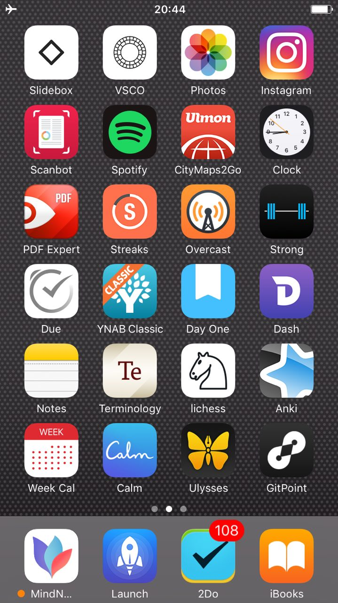
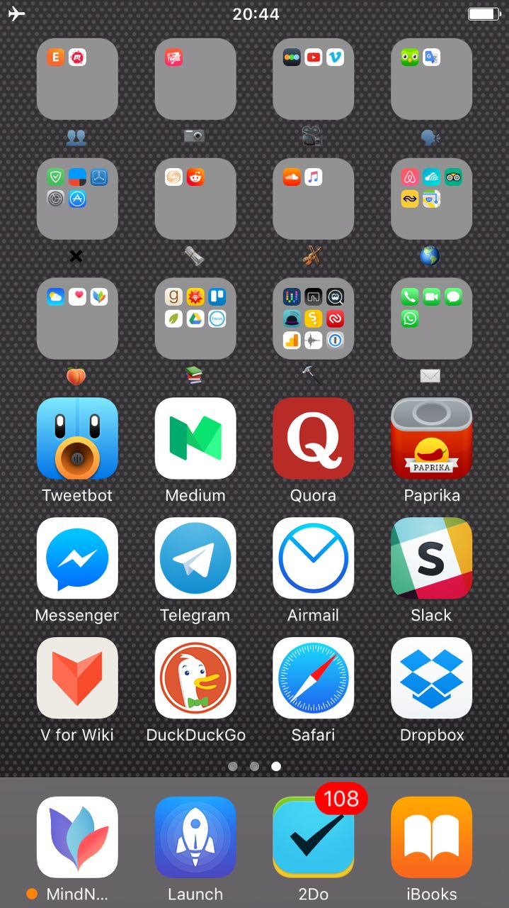

<h1 align="center"> my wonderful world of iOS 📱</h1>

	

<h1 align="center"> Screens</h1>

With success of my [macOS setup](https://github.com/nikitavoloboev/my-mac-os),
I wanted to write out how and what I use iOS for.

I use just two screens. The first screen contains applications I most often use : 

The second screen contains everything else sorted by folders with
few messaging applications on the bottom rows : 

My bottom dock contains my essential applications. My task manager, mind mapping app, a launcher and a book reader.

<h1 align="center"> Philosophy</h1>

For me, an iPhone is essentially a consumption and communication device. I can
do everything I can do on the phone, faster and better on the laptop. Thus
    I find it is very valuable to give each of these devices a well defined
    purpose and use them in this way. 

With all the freedom and power that a smartphone brings, it also brings a lot
of **distraction**. There is Twitter, Facebook, Instagram with their endless
feeds of streaming live updating content. Reddit, Hacker News, Medium or any other news outlet you prefer to stay on top of news. Staying on top of everything at all
times is exhausting and addictive, that is why I have a browser on my second
page and facebook deleted. Aside from [privacy issues that come with having Facebook](https://learn-anything.xyz/economics/business/companies/facebook) on your phone, the truth is that you never do need
it.

I use my phone when I am not using my computer. I use it to read books, update
my budget, make photographs, edit them, check tasks I have set out to do, listen to
podcasts, music, audio books, read wikipedia, answer messages on slack,
telegram, write quick notes and memos, search the internet and read my mail.
I of course do other things too, but these are the main ones. With that said,
I try to use the best tools that I can to get these tasks completed. 

<h1 align="center"> Apps </h1>

<h2 align="center"> Dock </h2>

- [2Do](http://www.2doapp.com/) 
	- this is where all my tasks, thoughts, plans live
	- can seperate the tasks into their relevant lists and filter through everything nicely
	- I tag most of my entries with a *time* tag and set priority for each task
- [Launch Centre Pro](https://contrast.co/launch-center-pro/)
	- iOS version of [Alfred](https://www.alfredapp.com) Launcher
	- [here](http://i.imgur.com/rdhb6gP.png) is how my main screen of it looks
		- here is [web](http://i.imgur.com/xdSOiSe.png) and [life](http://i.imgur.com/LE2E1eL.png) sections of it
	- I actually don't use it as much as I would like to as everything is already fast w/o a need of a launcher
		- but I like how I can make searches scoped to some site 
- [iBooks](https://itunes.apple.com/en/app/ibooks/id364709193?mt=8)
	- ideally this is where most of the time spent on the phone should be thus I have put it on the dock
	- I *try* to [read	a lot of books](https://www.goodreads.com/review/list/15768482?shelf=currently-reading)
		- why not help myself with the task by reading them on the go
	- I also love how I can add notes and highlights and how everything is synced up with iCloud

<h2 align="center"> Main Screen </h2>

- [Slidebox](https://itunes.apple.com/us/app/slidebox-photo-manager-album/id984305203?mt=8)
	- Apple's photos app has no easy way to delete multiple photographs
		- this solves it
- [Photos](http://www.apple.com/lae/ios/photos/)
	- right now my photos are a mess and I can't find a good way to organise them well like I can with [Pixave](http://www.littlehj.com/)
		- but nevertheless this is the only place right now where I can store my personal images
			- [google photos](https://photos.google.com) is too much of a privacy breach for me
- [Everyday](http://everyday-app.com)
	- I started taking a photograph of myself every day
	- it's actually pretty fun way to see yourself change and the timelapse movie it makes is pretty great and convenient 
- [VSCO](https://itunes.apple.com/us/app/vsco/id588013838?mt=8)
	- I am still learning how to edit photographs well but this app helps me with this task
	- the only edits I do are to add a filter and adjust brightness
- Music
	- I actually only use it to listen to audio books 
		- as I only like to listen to audio books and podcasts when I am commuting and am with my phone
- [YNAB Classic](https://itunes.apple.com/us/app/ynab-classic/id372076250?mt=8)
	- my budget tracker of choice
	- I set a budget for every category and try to fall within the bounds of my budget whilst I track every cent I spend
- [Strong](https://itunes.apple.com/us/app/strong-simple-workout-tracker/id464254577?mt=8)
	- don't use this app as much as I like but the times I do, I track my workouts
		- be it going to the gym and tracking sets I've made or simply home bodyweight exercises I make
- [Overcast](https://itunes.apple.com/us/app/overcast-podcast-player/id888422857?mt=8)
	- one of the most useful apps I have on the phone
	- let's me listen to the plethora of podcasts I love
	- it also has [smart speed](https://medium.com/@eped/overcasts-smart-speed-vs-real-time-a759549ab48b#.f05tiojfo) to cut out on silent pauses 
- [PDF Expert](https://itunes.apple.com/us/app/pdf-expert-edit-annotate-sign/id743974925?mt=8)
	- I mostly use this app on the laptop but if I do want to read any PDF on my phone, this is where I do it
- [CityMaps2Go](https://itunes.apple.com/us/app/citymaps2go-plan-trips-travel/id408866084?mt=8)
	- the ability to save maps locally is the main selling feature of the app
	- I use it for travelling and find it to be really accurate and have it find every location I am looking for in the city
- [Scanbot](https://itunes.apple.com/app/apple-store/id834854351?mt=8)
	- my life is fully digital
		- this means I scan every paper I write on
			- when I do that, the image gets dropped to my dropbox folder and from there gets picked up by [Pixave](http://www.littlehj.com/) and sorted accordingly
			- from there I can search for anything that I want quickly
- [Streaks](https://itunes.apple.com/en/app/streaks/id963034692?mt=8)
	- habits are extremely important to keep on top of things
	- [here](http://i.imgur.com/lVh8FjJ.png) are mine
- [Pocket](https://itunes.apple.com/en/app/pocket-save-articles-videos/id309601447?mt=8)
	- I have a lot of articles waiting for me to be read in Pocket
	- it's nice that I can slowly lower this number of undread pieces with my phone
- [Day One](http://dayoneapp.com)
	- I don't actually like to write on my phone as it is very inefficient 
	- I mostly use this app to read my *'on this day'* [entries](http://www.nikitavoloboev.xyz/post/day-evaluations/) I wrote a year or two ago and sometimes add photographs to my entries 
- [Ulysses](https://ulyssesapp.com)
	- Ulysses is my go-to place for anything I want to write
	- it has everything I need from a great note taking app
		- great organisation of content, search, markdown, simplicity, quick export to pdf
- [Anki](https://itunes.apple.com/us/app/ankimobile-flashcards/id373493387?mt=8&ign-mpt=uo%3D4)
	- [spaced repetition learning](http://www.wikiwand.com/en/Spaced_repetition) is extremely powerful
	- I try to use this fact when I can to make cards on things I actually want to memorise
		- mostly it is english, russian words I learn or some mathematical rules or some other computer science concept I want to memorise
- [Mindnode](http://mindnode.com/) 
	- mind mapping is really awesome
	- I use it to plan out my weekly tasks I have for the week 
	- I use it to plan out and break down any projects I am working on, books I want to read and when
- Notes
	- I use it to jot down names of people I meet and some other trivia information I don't really need to index straight away
- Clock
	- I love that Apple finally added night mode to the app
	- I use it to set my alarms, timers (created by Siri)
- [Terminology](https://itunes.apple.com/us/app/terminology-3-extensible-dictionary/id687798859?mt=8)
	- I use it to find definitions of new words I encounter whilst reading a book or reading the internet
	- I find the definitions to be really well thought out and understandable
	- I then star the words I don't know and move them all to Anki so I actually learn them
- [Week Cal](https://itunes.apple.com/app/id381059732)
	- I use it to mostly view what is ahead in my schedule for the next day / week
		- or adjust my events where necessary
- [Focus](https://itunes.apple.com/app/focus-productivity-timer/id975017240?mt=8)
	- pomodoro timers are really great as they give you a very specific time frame where you can focus
	- I mostly use the app on the macbook as that is where I do real work but sometimes a small pomodoro session from the phone is also great to have
- [Toggl Timer](https://itunes.apple.com/us/app/toggl-work-time-tracker/id885767775?mt=8)
	- I try and track all the time I spend so that I can both be conscious of what it is I am doing and later analyse the data and see where I can improve and where my time is really being spent
- [Due](http://www.dueapp.com/)
	- this is a pretty neat app to set out quick timers for things either recurring or one time
	- I mostly use it to set quick actionable reminders

<h1 align="center"> Second Screen </h1>
<h2 align="center"> Bottom Row </h2>

- [Telegram](https://itunes.apple.com/app/telegram-messenger/id686449807)
	- I really like this messenger over whatsapp (due to whatsapp being property of Facebook)
	- it has a native desktop client unlike whatsapp, fun stickets and bots
- [Airmail](http://airmailapp.com/ios)
	- I really like this email client for its simplicity and features
	- I also use it on my laptop too so it is nice to have all the settings in sync
- [Slack](https://slack.com)
	- Slack is a pretty great tool for team communication but it can get really overflowing with the amount of things one can read especially if you have many channels
	- that's why I just keep the most important channels I frequent on the phone and keep everything else on the laptop
- [Viki](https://itunes.apple.com/us/app/viki-nice-reader-for-wikipedia/id993435362?mt=8)
	- I love wikipedia
		- you can easily get lost in the amount of articles it has and how everything is neatly linked together
		- this app makes the process of discovery and reading of this new knowledge easier and prettier to the eye
- [Safari](http://www.wikiwand.com/en/Safari_(web_browser))
	- best browser on iOS, hands down
	- use it both on macOS and iOS and am quite happy with this choice
- [Dropbox](https://itunes.apple.com/en/app/dropbox/id327630330?mt=8)
	- I like using Dropbox more than Google Drive as I find Dropbox's integration with macOS to be a lot better
	- use it to send myself books to read on my phone, keep some of my file data synced and synchronise a couple of applicatios that require Dropbox for syncing

<h1 align="center"> Thanks 🍀</h1>

You can support what I do on [Patreon](https://www.patreon.com/nikitavoloboev) or look [into other repositories](https://my.mindnode.com/ZKGETDkUaQUsL3q8q9z788CxG84oEHgDiT79GuzX#-191.2,-905.2,2) I shared. Thank you. 💛 

